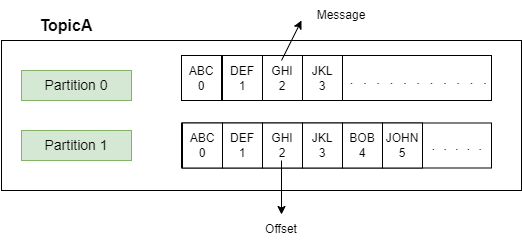

# Apache Kafka Labs
## จุดประสงค์ของ Lab

- เข้าใจ concept การทำงานเบื้องต้นของ apache kafka
- ทำความรู้จักองค์ประกอบและฟังค์ชั่นการทำงานขั้นเบื้องต้นของ apache kafka
- เข้าใจการเดินทางของข้อมูล และการแบ่งส่วนในการทำงานของ partitions

## หัวข้อ Lab
 - ทำความรู้จักกับ apache kafka
 - ส่วนประกอบสำคัญของ apache kafka
	- brokers
	     - topics
	     - partitions
	     - offsets
	     - records
	     - replications
	- zookeepers
	- kafka cluster
	- producer systems	
	- consumer systems	
 -  หลักการทำงานของ apache kafka 
	 - แสดง kafka data flow
	 -  round robin concept
	 - การส่งข้อมูลแบบแบ่ง partitions process **(consumer group)**
		 - batch
		 - timeout
	 - การส่งข้อมูลชุดเดียวกันไปยังหลาย consumer 
- coding lab
	- lab 0 อธิบายชุดเครื่องมือและการติดตั้ง
	- lab 1 ติดตั้ง kafka
	- lab 2 ออกแบบ topic ภายใน kafka
	- lab 3 รับ-ส่ง ข้อมูลเบื้องต้น
	- lab 4 เชื่อมต่อ node.js consumer กับ kafka
	- lab 5 ทำความรู้จักกับ consumer group
	- lab 6 เชื่อมต่อ node.js producer กับ kafka
	- lab 7 ทดสอบส่งข้อมูลจาก producer ไปยัง consumer
	- lab 8 ทำความรู้จักกับ round robin partitions
	- lab 9 ทดสอบ api used case
# ทำความรู้จักกับ Apache Kafka

Apache Kafka เป็นแพลตฟอร์มที่พัฒนาขึ้นเพื่อการจัดการข้อมูลแบบสตรีมมิ่ง (streaming data) โดยมีความสามารถในการจัดเก็บ ประมวลผล และส่งต่อข้อมูลจำนวนมากไปยังclient kafkaถูกออกแบบมาเพื่อรองรับแอปพลิเคชันแบบกระจาย (distributed applications) และสามารถปรับขยาย (scalable) ได้ง่าย ถูกใช้งานในระบบต่างๆ เช่น การวิเคราะห์ข้อมูลแบบเรียลไทม์ การบันทึกล็อก และการเชื่อมต่อระบบต่างๆ

----------

## ส่วนประกอบสำคัญของ Apache Kafka

<div style="text-align: center;">
    
</div>

### 1. Brokers

-   Broker คือเซิร์ฟเวอร์ที่ทำหน้าที่จัดเก็บและจัดการข้อมูลใน Kafka cluster โดยหนึ่งคลัสเตอร์อาจมี broker หลายตัวเพื่อรองรับการกระจายข้อมูลและการเพิ่มความน่าเชื่อถือ (fault tolerance)
    
-   แต่ละ broker มีหมายเลขประจำตัว (ID) และทำหน้าที่ประสานงานกับ brokers อื่นๆ ในคลัสเตอร์

<br/>
    


### 2. Topics

-   Topic เป็นกลไกที่ใช้สำหรับการจัดเก็บข้อความหรือข้อมูลในระบบ kafka ใช้ในการเชื่อมต่อกันระหว่างผู้ส่งข้อมูล (Producers) กับผู้รับข้อมูล (Consumers) 
ซึ่งใน 1 Broker จะสามารถมี Topics ได้ <strong>N</strong> Topics
โดยคุณสมบัตพิเศษของ​ Topics นั้นคือตัวมันเองสามารถแบ่งการเก็บข้อมูลเป็น Partition(n) ได้ จึงทำให้ลดภาระในการจัดเก็บ และค้นหาข้อมูลได้


### 3. Partitions

-   ในแต่ละ Topic จะถูกแบ่งออกเป็นหลาย Partitions ขึ้นอยู่กับผู้ส่งข้อมูล (Producers) เป็นคนกำหนด เพื่อเพิ่มประสิทธิภาพในการจัดการข้อมูล
    
-   ข้อมูลใน Partitions จะถูกจัดเก็บในรูปแบบลำดับเหตุการณ์ (sequential log) หรือที่เรียกว่า First In First Out (FIFO) ข้อมูลใหนเข้ามาก่อน ก็​จะต้องออกไปก่อนตามลำดับ

- ภายใน Partitions จะมีส่วนย่อยในการเก็บข้อมูลที่เรียกว่า Records ซึ่งเป็นหน่วยเก็บข้อมูลที่เล็กที่สุดของ Kafka Systems เปรียบเสมือน​กล่องเก็บข้อความแต่ละข้อความ โดยมีเลขลำดับ (Offsets) เป็นตัวกำกับ 

- แต่ละ Partitions จะพยายามกระจาย​ Record ให้เท่ากันมากที่สุดในกร​ณีที่ Topic นั้นมี Partitions มากกว่า 1

<br/>

<div style="text-align: center;">
    
</div>

### 4. Offsets

-   Offset คือค่าที่ใช้ระบุลำดับของ Record ใน Partition
    
-   ผู้รับข้อมูล(Consumer) ใช้ Offset เพื่อระบุว่าข้อมูลใดถูกอ่านแล้ว หรือยังไม่ได้อ่าน
    

### 5. Records

-   Record เป็นหน่วยข้อมูลที่เก็บใน Kafka โดยแต่ละ Record มี key, value, และ metadata เช่น timestamp

- เป็นหน่วยเก็บข้อมูลที่เล็กที่สุด ข้อมูลที่ผู้ส่ง(Producer) ส่งมานั้น จะถูกสุ่ม Partition แล้วนำข้อมูลบรรจุไปยัง Record ของ Partition นั้น ๆ 
    

### 6. Replications

-  Replicaset ใน Kafka หมายถึงชุดของ Replica (สำเนาของ Partition) ที่กระจายอยู่ตาม Broker ต่างๆ

-  สรุปคือ Replica เป็นตัวทำการสำรองข้อมูลไปยัง Broker อื่น ๆ เพื่่อกระจ่ายความเสี่ยง​ของการเก็บข้อมูลหากมี Broker ใด หายหรือตายไป จะยังคงมีอีก 1 Broker ที่สามารถทำงานแทนกันได้ 
- การปรับแต่ง Replica นั้นต้องจำเป็นต้อง​แบ่งให้สอดคล้องกับ Broker ที่มีอยู่ ณ​ ตอนนั้นด้วย
- กรณีการใช้งานดังนี้<table>
	<tr>
		<th>จำนวน Replica</th>
		<th>จำนวน Broker</th>
		<th>ทำได้ไหม</th>
		<th>ข้อดี</th>
		<th>ข้อเสีย</th>
	</tr>
	<tr>
		<td>1</td>
		<td>2</td>
		<td>ได้</td>
		<td>ประหยัด storage</td>
		<td>ใช้ Broker ไม่คุ้ม เพราะบาง Broker อาจไม่ได้ถือ replica ของ partition นั้นเลย</td>
	</tr>
	<tr>
		<td>2</td>
		<td>2</td>
		<td>ได้</td>
		<td>ทุก Broker มี replica ของทุก Partition → redundancy สูงสุด</td>
		<td>ใช้พื้นที่มาก (ข้อมูลทุก partition ถูก copy ไปทุก broker) → เปลือง resource</td>
	</tr>
	<tr>
		<td>2</td>
		<td>1</td>
		<td>ไม่ได้</td>
		<td> - </td>
		<td>เพราะ Kafka ไม่สามารถวาง Replica ซ้ำกันบน Broker เดียวกันได้ (จะเสียประโยชน์ของ redundancy)</td>
	</tr>
	</table>

	
    

### 7. Zookeepers

-   Zookeeper ทำหน้าที่จัดการ metadata และประสานงานระหว่าง components ต่างๆ ใน Kafka cluster
    
-   ใน Kafka รุ่นใหม่ (2.8 ขึ้นไป) มีการพัฒนา KRaft (Kafka Raft) เพื่อมาแทนที่ Zookeeper
    

### 8. Kafka Cluster

-   Kafka Cluster คือกลุ่มของ brokers ที่ทำงานร่วมกันเพื่อจัดเก็บและจัดการข้อมูล
    
-   Cluster นี้สามารถปรับขยาย (scale out) ได้ง่ายโดยเพิ่มจำนวน brokers
    

### 9. Producer Systems

-   Producer คือแอปพลิเคชันที่ส่งข้อมูลเข้าสู่ Kafka
    
-   Producer สามารถระบุ topic และส่งข้อมูลไปยัง partitions ได้อย่างเหมาะสม
    
-   Producer สามารถกำหนดกลยุทธ์การกระจายข้อมูล เช่น การใช้ key-based partitioning เพื่อจัดเก็บข้อมูลใน partition ที่ระบุอย่างเฉพาะเจาะจง
    

### 10. Consumer Systems

-   Consumer คือแอปพลิเคชันที่ดึงข้อมูลจาก Kafka
    
-   Consumer สามารถจัดกลุ่ม (consumer group) เพื่อกระจายงานกันอ่านข้อมูลจาก partitions ต่างๆ
    
-   Consumer สามารถปรับแต่งการใช้งาน เช่น การกำหนด offset ในการเริ่มต้นอ่านข้อมูล หรือเลือกอ่านข้อมูลตั้งแต่ต้น (reset offset)
    

----------

## หลักการทำงานของ Apache Kafka

1.  Producer ส่งข้อมูลเข้า Kafka โดยระบุ topic ที่ต้องการ
    
2.  Kafka จะจัดเก็บข้อมูลใน partitions ของ topic ที่กำหนด
    
3.  Consumer จะดึงข้อมูลจาก partitions ตามลำดับ offset ที่ยังไม่ได้อ่าน
    
4.  การทำสำเนาข้อมูลช่วยให้ระบบมีความน่าเชื่อถือและป้องกันข้อมูลสูญหาย
    
5.  Kafka รองรับการจัดการข้อมูลแบบ real-time และ batch processing ได้พร้อมกัน
    

----------

## แสดง Kafka Data Flow

1.  Producer -> Kafka Brokers -> Partitions
    
2.  Kafka Brokers -> Consumer (ผ่าน consumer group)
    
3.  Consumer Group -> การดึงข้อมูลในลักษณะ parallel เพื่อเพิ่มความเร็วในการประมวลผล
    

----------

## Round Robin Concept

-   Producer สามารถกระจายข้อมูลไปยัง partitions ต่างๆ โดยใช้ round robin ซึ่งเป็นการกระจายข้อมูลแบบวนรอบ
    
-   เทคนิคนี้ช่วยให้ข้อมูลถูกกระจายอย่างสมดุล (balanced) ในแต่ละ partition
    

----------

## การส่งข้อมูลแบบแบ่ง Partitions Process (Consumer Group)

-   Consumer Group คือกลุ่มของ consumers ที่ทำงานร่วมกันเพื่ออ่านข้อมูลจาก partitions ของ topic เดียวกัน
    
-   Consumer แต่ละตัวในกลุ่มจะรับผิดชอบ partitions ที่แตกต่างกันโดยไม่ซ้ำกัน
    
-   Kafka ใช้กลไกการจัดการ load balancing ใน consumer group เพื่อให้แต่ละ consumer ทำงานอย่างมีประสิทธิภาพ
    

----------

## Batch

-   Batch เป็นการรวมข้อมูลหลาย records เข้าด้วยกันก่อนส่งหรือประมวลผล
    
-   Batch ช่วยลด overhead ของการส่งข้อมูลและเพิ่มประสิทธิภาพ
    
-   Producer สามารถตั้งค่าขนาด batch (batch.size) เพื่อปรับแต่งการทำงานให้เหมาะสมกับปริมาณข้อมูล
    

----------

## Timeout

-   Timeout เป็นการกำหนดเวลาสูงสุดที่ระบบต้องรอการยืนยันหรือการดำเนินการ เช่น producer timeout หรือ consumer poll timeout
    
-   Kafka รองรับการกำหนด session.timeout.ms สำหรับ consumer group เพื่อตรวจสอบว่า consumer ยังคงทำงานอยู่หรือไม่
    

----------

## การส่งข้อมูลชุดเดียวกันไปยังหลาย Consumer

-   หากต้องการส่งข้อมูลชุดเดียวกันไปยัง consumers หลายกลุ่ม สามารถสร้าง consumer groups แยกกัน
    
-   แต่ละ consumer group จะได้รับข้อมูลชุดเดียวกันจาก Kafka โดยไม่กระทบกัน
    
-   ข้อมูลที่ส่งผ่าน Kafka สามารถถูกนำไปใช้ในหลายกรณี เช่น การทำ real-time analytics, data processing, และการเก็บข้อมูลแบบ long-term storage
    

----------

## คุณสมบัติเพิ่มเติมที่น่าสนใจ

### Exactly-Once Delivery

-   Kafka รองรับการส่งข้อมูลแบบ "exactly-once" ซึ่งหมายความว่าข้อมูลจะถูกส่งและประมวลผลเพียงครั้งเดียวโดยไม่มีการซ้ำ
    

### Stream Processing ด้วย Kafka Streams

-   Kafka Streams เป็นไลบรารีที่ช่วยให้ผู้พัฒนาสามารถประมวลผลข้อมูลแบบสตรีมมิ่งได้ง่ายขึ้น เช่น การกรองข้อมูล การรวมข้อมูล หรือการคำนวณค่าต่างๆ ใน real-time
    

### Schema Registry

-   Apache Kafka สามารถใช้งานร่วมกับ Confluent Schema Registry เพื่อจัดการ schema ของข้อมูลที่ส่งผ่าน Kafka
    
-   ช่วยลดปัญหาความไม่สอดคล้องกันของ schema ระหว่าง producer และ consumer
    

### การตรวจสอบและการติดตาม (Monitoring)

-   Kafka รองรับการตรวจสอบผ่านเครื่องมืออย่าง Prometheus, Grafana หรือ Confluent Control Center เพื่อช่วยติดตามสถานะการทำงานของระบบ
    

----------

 ## Instructions
 * Install 
	 * **2 broker**, 
	 * **2 zookeper**	
	 * **1 ui for apache kafka**
	
## TOPICS
#### Create Topics
``` 
docker exec -it kafka1 bash 
```

```
kafka-topics.sh --create --bootstrap-server <BROKER_URL> --replication-factor <REPLICATION_FACTOR> --partitions <PARTITIONS> --topic <TOPIC_NAME> 
```

#### Verify Topic Creation

After creating the topic, you can verify it with the `--list` option:
```
kafka-topics.sh --list --bootstrap-server kafka1:9092
``` 

You should see `my-topic` in the list of topics.

#### **Optional: Describe the Topic**

To see detailed information about the topic, use the `--describe` option:
```
kafka-topics.sh --describe --bootstrap-server kafka1:9092 --topic <TOPIC_NAME>
```


## Producers

### Send Messages 
#### 1. **Access the Kafka Container**

If Kafka is running in Docker, first log in to the Kafka container:


```
docker exec -it kafka1 bash
``` 

----------

#### 2. **Run the Kafka Console Producer**

Use the `kafka-console-producer.sh` command to send messages to a topic.

##### Basic Syntax:

```
kafka-console-producer.sh --broker-list <BROKER_URL> --topic <TOPIC_NAME>
``` 

##### Example:

To send messages to a topic named `my-topic` via `kafka1:9092`:


```
kafka-console-producer.sh --broker-list kafka1:9092 --topic <TOPIC_NAME>
``` 

----------

#### 3. **Enter Messages**

After running the command, you’ll see a prompt where you can type messages. Each line you type will be sent as a separate message to the topic. For example:


```
> Hello, Kafka!
> This is my first message.
> Another message here.
> ...I
``` 

Press **Enter** after each message to send it.

----------

#### 4. **Verify the Messages**

You can consume the messages to verify they were sent successfully. Use the `kafka-console-consumer.sh` tool:

```
kafka-console-consumer.sh --bootstrap-server kafka1:9092 --topic <TOPIC_NAME> --from-beginning
``` 

This will display all the messages in the topic, starting from the first one.

----------

#### Optional: Keyed Messages

If your topic supports keys, you can send key-value messages using the `--property` flag:

```
kafka-console-producer.sh --broker-list kafka1:9092 --topic <TOPIC_NAME> --property parse.key=true --property key.separator=:
```

Then, enter key-value messages like this:

```
key1:message1
key2:message2
```
